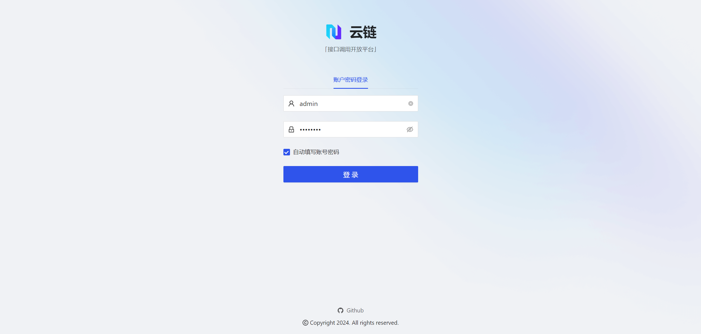
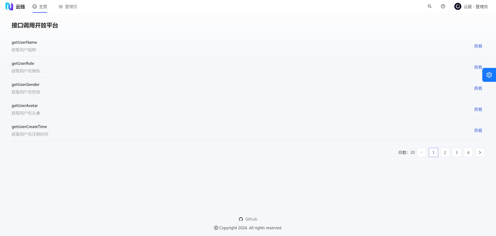
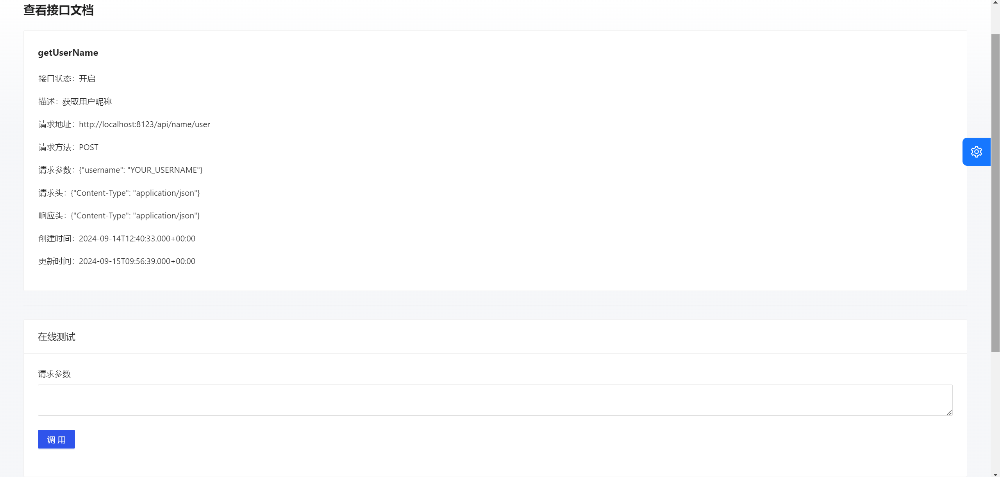
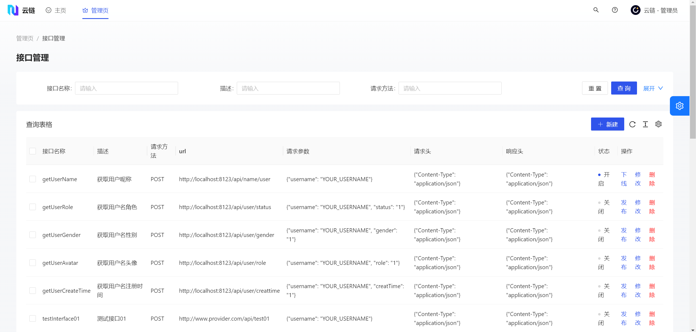
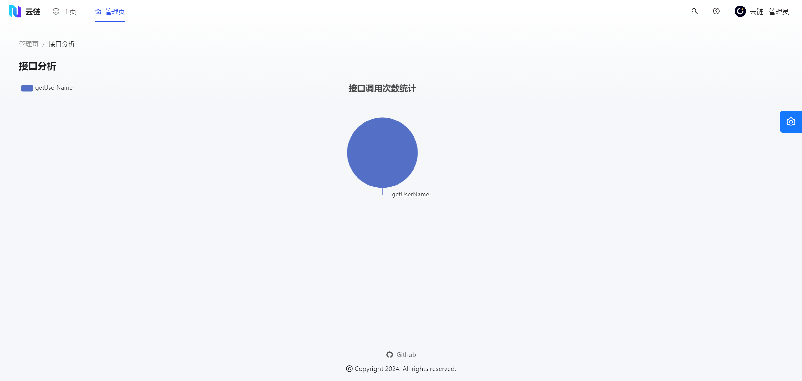

## 项目介绍

本项目旨在为开发者们打造一站式接口在线调用 / 发布 / 管理的开放平台！

如果你是一位正在寻找测试接口的开发者，那么你可以在该平台：

- 🔎 在线查看该平台发布 / 待发布的所有接口
- 🚀 在线调用 / 测试该平台已发布的所有接口

如果你是一位正在开发对外公开接口的开发者，那么你可以在该平台：

- ✅ 提交你的接口信息，管理员在审核通过后会将该接口加入到平台数据库中
- 📊 获得你的接口被调用的数据分析，管理员会将相关接口的分析数据反馈给你

❗ 本仓库包含该项目的完整 **前端** 代码

## 技术选型

- [React](https://react.dev) 
- [OpenAPI](https://www.openapis.org) 
- [Ant Design Pro](https://pro.ant.design/zh-CN) 
- [Ant Design](https://ant.design/index-cn) 
- [ProComponents](https://procomponents.ant.design) 
- [UmiJS](https://umijs.org) 

## 项目展示

登录页



主页（接口总览）



接口在线调用



接口管理（仅限管理员）



接口分析（仅限管理员）



## 依赖安装

本项目使用 yarn 作为包管理工具，如果你对该项目感兴趣，在将源代码克隆到本地后，可以使用如下指令安装依赖：

```bash
yarn
```

然后，你可以使用如下指令启动项目：

```bash
yarn run dev
```

打包项目的指令为：

```bash
yarn run build
```
